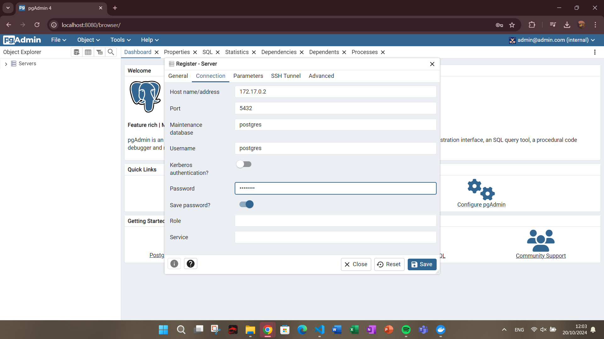

### Crear contenedor de Postgres sin que exponga los puertos. Usar la imagen: postgres:11.21-alpine3.17

```
docker run -d --name postgres-cont -e POSTGRES_PASSWORD=password postgres:11.21-alpine3.17
```

### Crear un cliente de postgres. Usar la imagen: dpage/pgadmin4

```
docker run -d --name pgadmin-cont -e PGADMIN_DEFAULT_EMAIL=admin@admin.com -e PGADMIN_DEFAULT_PASSWORD=password --publish published=8080,target=80 dpage/pgadmin4
```

La figura presenta el esquema creado en donde los puertos son:
- a: 5432
- b: 80
- c: 8080


## Desde el cliente
### Acceder desde el cliente al servidor postgres creado.




### Crear la base de datos info, y dentro de esa base la tabla personas, con id (serial) y nombre (varchar), agregar un par de registros en la tabla, obligatorio incluir su nombre.

```sql
CREATE TABLE personas (
    id SERIAL PRIMARY KEY,
    nombre VARCHAR(30) NOT NULL
);
```


## Desde el servidor postgresl
### Acceder al servidor
### Conectarse a la base de datos info

```
docker exec -it postgres-cont sh

/ # psql -U postgres -d info

info=# select * from personas;
```
### Realizar un select * from personas


