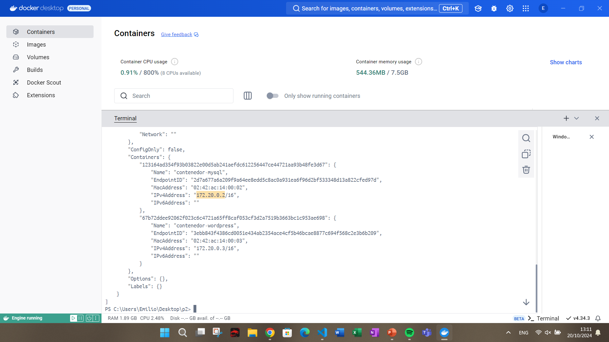
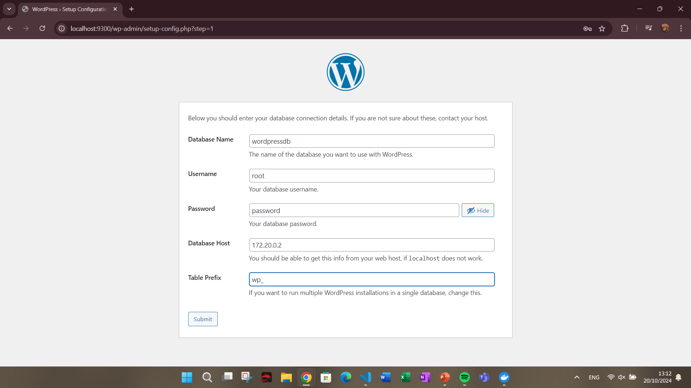
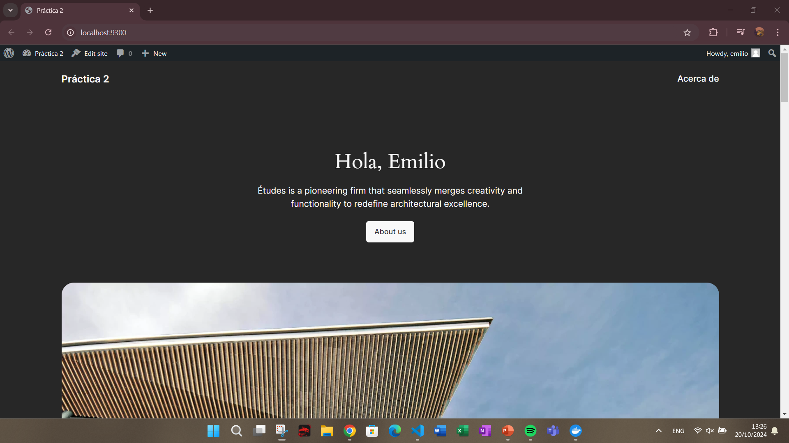
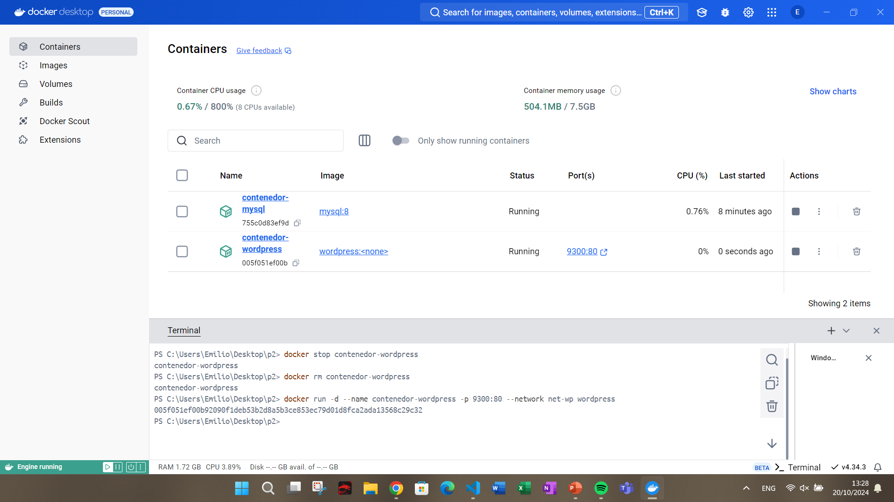
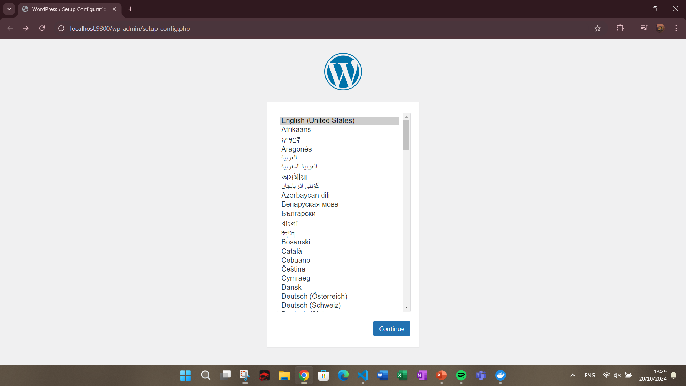

## Esquema para el ejercicio


### Crear la red
```
docker network create net-wp -d bridge
```

### Crear el contenedor mysql a partir de la imagen mysql:8, configurar las variables de entorno necesarias
```
docker run -d --name contenedor-mysql -e MYSQL_ROOT_PASSWORD=password -e MYSQL_DATABASE=wordpressdb --network net-wp mysql:8
```

### Crear el contenedor wordpress a partir de la imagen: wordpress, configurar las variables de entorno necesarias
```
docker run -d --name contenedor-wordpress -p 9300:80 --network net-wp wordpress
```

De acuerdo con el trabajo realizado, en el esquema de ejercicio el puerto a es **9300**


Ingresar desde el navegador al wordpress y finalizar la configuración de instalación.

### Dirección Contenedor MySQL



### Configuración Wordpress



Desde el panel de admin: cambiar el tema y crear una nueva publicación.
Ingresar a: http://localhost:9300/ 
recordar que a es el puerto que usó para el mapeo con wordpress
# COLOCAR UNA CAPTURA DEL SITO EN DONDE SEA VISIBLE LA PUBLICACIÓN.




### Eliminar el contenedor wordpress
```
docker stop contenedor-wordpress

docker rm contenedor-wordpress
```

### Crear nuevamente el contenedor wordpress
Ingresar a: http://localhost:9300/ 
recordar que a es el puerto que usó para el mapeo con wordpress



### ¿Qué ha sucedido, qué puede observar?

Se borró la configuración anterior del anterior contenedor de wordpress

